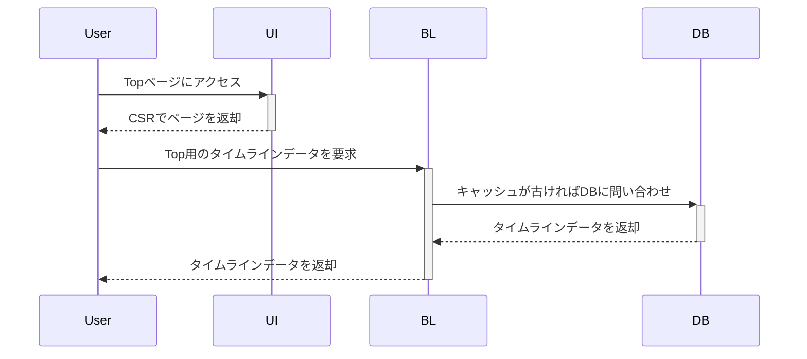
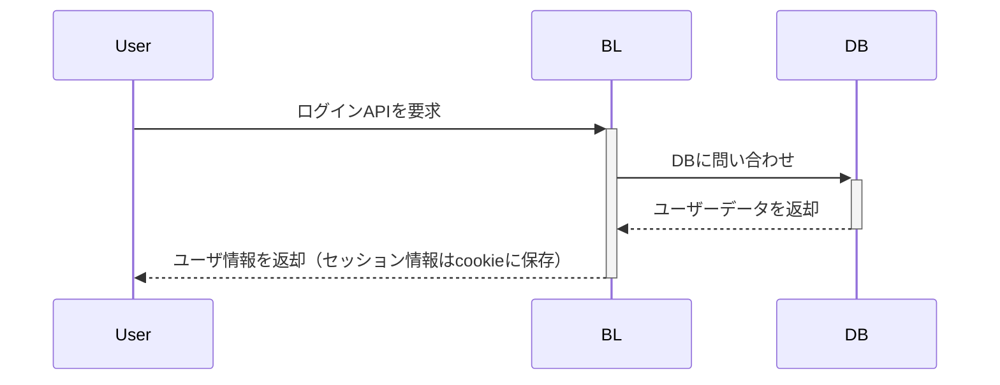
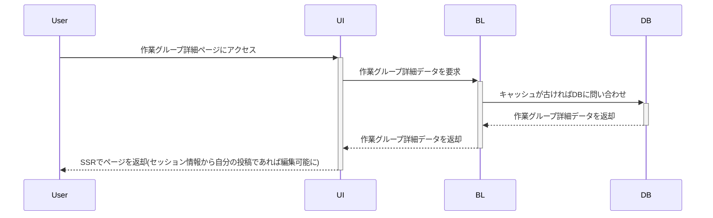
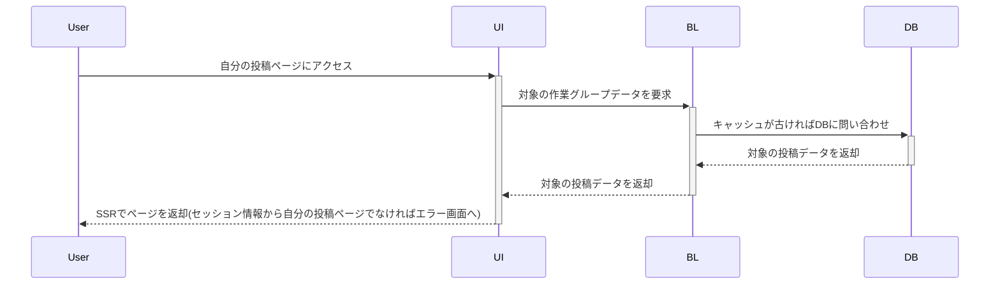

# Wip-Share(仮名)について
wip-shareは作業進捗を気軽に発信、他の人からのアクションなども見てモチベを上げるための投稿ツール
* 進捗を1つのグループ内に投稿できることでタイムラインに埋もれない
* 投稿へのリアクションは コメント < スタンプ (コメントはできない)
* 1投稿に1画像でシンプルなUI/UXに（できるのであればそのうち動画などのデータも扱いたい）

ユーザは「投稿者」と「閲覧者」に大きく分類される

### 投稿者
  * ログイン・認証必須
  * 投稿したものは外部SNSで共有可
  * 進捗を1ポストに1画像投稿、それをチェインして完成を目指していく感じ

### 閲覧者
  * ログインなしでも閲覧可能
  * タイムライン上に流れたり、シェアされたリンクを通して閲覧可能
  * 見るだけならだれでも見れるが、アクションや保存などの機能はログイン必須

## リリース予定
### 必要機能
v0.0.5
* 認証機能(外部認証OAuthなどを利用)
  - まずはGoogle、他使えるならXなども
  - [ ] supabaseAuth
  - [ ] その他外部OAuth認証
* 投稿機能
  - [x] 画像アップロード(webp形式)
  - [x] 新規投稿（グループ作成）
  - [x] 追加投稿
  - [ ] グループ投稿編集
* タイムライン機能
  - [x] 新しい順（更新された順）
  - [ ] 作業中のグループ投稿
  - [ ] 完了したグループ投稿
* 進捗詳細閲覧機能
  - [ ] 自身のすべての投稿表示
  - [x] 自身の作業中投稿表示
  - [ ] 自身の完了した投稿表示

* 投稿ユーザ招待制機能
  - [ ] 期限付き招待リンク

ここ目度でリリース（投稿者は招待制）
投稿の整合性やセキュリティはある程度しっかりと

---

v0.1.0
* ユーザ情報照会・更新機能
* 共有機能（ワンボタンで外部SNSと連携）
* アクション機能（いいね、スタンプ）

以降の構想
* ポイント機能(mochi)
  * ログインボーナスや投稿頻度でポイントゲット(作業終了 => 投稿数 × 1mochi)
  * ポイントから特別な応援スタンプや投稿数を増やせる
  * ポイントを課金でも買えるように(1mochi = 1円みたいな)

* 作業配信（ワークスペース）

## ルール・規則
  * R18画像は投稿不可（R15作品まで）
  * 作業中の投稿グループは同時に3つまで（それ以上は一つでも完了させないと不可）
  * 投稿グループはそれぞれ1日1件の投稿まで（後々課金やポイントで増やせるように、ソシャゲのスタミナみたいな感じで）
  * 投稿は1つのグループに10件の投稿まで（これも後々ポイントや優良ユーザは増やせるように）
  * 投稿は1つの画像とノート必須（投稿は動画などもできるようにしたいがそこはコストとの兼ね合い）

## スキルスタック
+ React/Next.js
+ Typescript
+ PostgreSQL
+ GitHub
+ GitHub Copilot
+ supabase
+ Vercel（予定）

## テーブル
supabaseのテーブルとストレージを使う

作業グループテーブル
物理名|型
---|---
group_id       | uuid
user_id        | varchar(25)
title          | varchar(50)
content        | string
images         | URL[]
close_flag     | boolean
create_datetime| timestanp
update_datetime| timestanp
delete_flag    | boolean
delete_datetime| timestanp

作業ポストテーブル
物理名|型
---|---
post_id        | uuid
group_id       | uuid
image          | URL
content        | string(varchar(200))
create_datetime| timestanp
update_datetime| timestanp
delete_flag    | boolean
delete_datetime| timestanp

ユーザ情報テーブル
物理名|型
---|---
user_id|string
user_name|string
icon_image|string
note|string

以下v0.1.xリリース======

リアクション情報テーブル
物理名|型
---|---
id
group_id
user_id
type

スタンプ情報テーブル(グループ)
物理名|型
---|---
id      | uuid
group_id| uuid
user_id | string
stamp_id| uuid

スタンプ情報テーブル(ポスト)
物理名|型
---|---
id      | uuid
post_id | uuid
user_id | string
stamp_id| uuid

スタンプ管理マスタ
物理名|型
---|---
id          | uuid 
stamp_image | string

### 処理フローイメージ
#### Top画面

#### ログイン処理

##### 作業グループ詳細画面（未ログイン・ログイン済）

#### 自分の投稿画面
